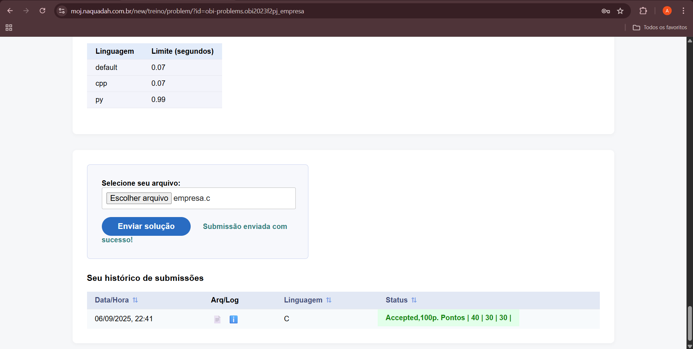
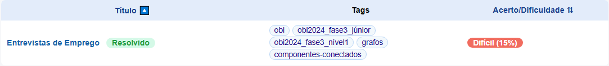
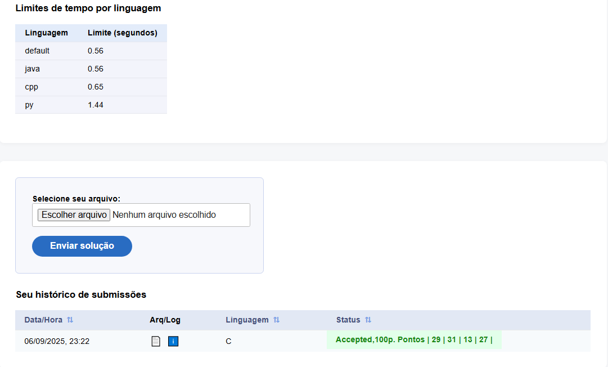

# Grafos1-MOJ-D43

**Conteúdo da Disciplina**: Grafos 1 

## Alunos
|Matrícula | Aluno |
| -- | -- |
| 23/1011088 |  Ana Luiza Soares de Carvalho |
| 22/1039209  |  Letícia de Cássia Hladczuk Rodrigues |

## Sobre 
Para o Trabalho 1 a dupla optou por solucionar questões da plataforma CD-MOJ. Seguindo as orientações do professor Maurício Serrano, resolvemos 3 desafios. Dois do nível difícil. Dessa maneira, a dupla busca demonstrar o conhecimento adquirido durante as aulas e estudos sobre o tema Grafos 1.

Sobre a realização do trabalho, cada exercício contém seu código resposta, screenshots da tela de submissão do CD-MOJ e vídeo de até 5 minutos explicando objetivamente as resoluções propostas.

## Exercícios
| Exercício | Nível  |
| -- | -- | 
| [Chuva](https://moj.naquadah.com.br/new/treino/problem/?id=obi-problems.obi2019f1p2_chuva) | Difícil |  
| [Empresa](https://moj.naquadah.com.br/new/treino/problem/?id=obi-problems.obi2023f2pj_empresa) | Difícil |  
| [Entrevistas de Emprego](https://moj.naquadah.com.br/new/treino/problem/?id=obi-problems.obi2024f3pj_entrevistas) | Difícil |  

## Vídeo da Apresentação

Link para a apresentação:

-[Clique aqui](https://youtu.be/3-C7zIUI2iI?si=_cWXf61Cs9fC5VHY)

<iframe width="560" height="315" src="https://www.youtube.com/embed/3-C7zIUI2iI?si=1QBkOG3fNX9ctdU3" title="YouTube video player" frameborder="0" allow="accelerometer; autoplay; clipboard-write; encrypted-media; gyroscope; picture-in-picture; web-share" referrerpolicy="strict-origin-when-cross-origin" allowfullscreen></iframe>

## Screenshots

### Exercício 1 - Difícil - [Chuva](https://moj.naquadah.com.br/new/treino/problem/?id=obi-problems.obi2019f1p2_chuva).

### Exercício 2 - Difícil - [Empresa](https://moj.naquadah.com.br/new/treino/problem/?id=obi-problems.obi2023f2pj_empresa).

### Exercício 3 - Difícil - [Entrevistas de Emprego](https://moj.naquadah.com.br/new/treino/problem/?id=obi-problems.obi2024f3pj_entrevistas).

## Instalação 
**Linguagem**: A linguagem de programação utilizada para resolver cada exercício foi o C. 

## Outros 
Quaisquer outras informações sobre seu projeto podem ser descritas abaixo.
